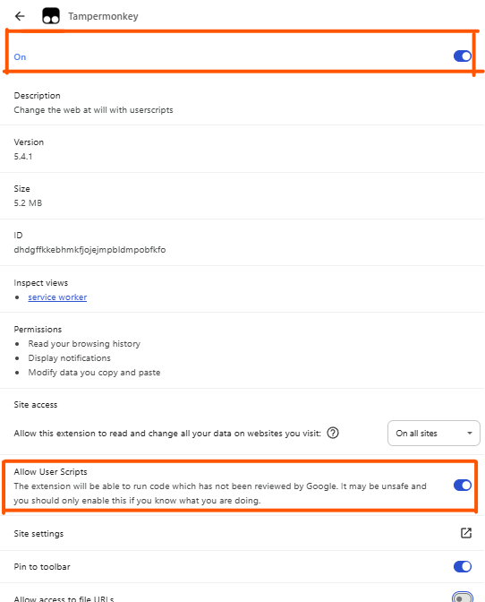

# Esfera-PowerToy-Avaluacio-massiva-per-DNI
Millora accessibilitat per a la plataforma Esfer@ d'avaluació del Departament d'Educació de la Generalitat de Catalunya.

Permet aplicar les notes (o l'estat) d'un RA a tot l'alumnat d'un grup. Malauradament, cal fer-ho RA a RA.

(Inspirat en el projecte [EsferaPowerToys](https://github.com/ctrl-alt-d/EsferaPowerToys/tree/main))

---

## 🔧 Requisits

Per instal·lar aquest script necessites:

- 🔌 [Tampermonkey](https://www.tampermonkey.net/) — una extensió per a navegadors que permet executar scripts d'usuari.
- 🌐 Un navegador compatible (Chrome, Firefox, Edge...).

---

## 🚀 Instal·lació

1. Instal·la **Tampermonkey** des de la seva web oficial, selecciona el teu navegador i ves a l'apartat `Download`:  
   👉 [https://www.tampermonkey.net/](https://www.tampermonkey.net/)

2. [Només si fas servir Chrome] Ves a la configuració de l'extensió i assegura't que estan autoritzats els scripts d'usuari.

3. Fes clic aquí per instal·lar l'Esfer@a PowerToys:  
   👉 [`Esfera-PowerToy-Avaluacio-massiva-per-DNI
`](https://raw.githubusercontent.com/jrlgillue/Esfera-PowerToy-Avaluacio-massiva-per-DNI/main/esfera-avaluacio-dni.user.js)

   Tampermonkey t'obrirà una pestanya amb el codi i un botó per **"Install"**.

4. Un cop instal·lat, quan entris a qualificacions finals per grup i alumne/a et permetrà fer copy-paste de les notes des d'un full de càlcul.

   L'script s'activarà automàticament.

---

## Funcionalitats actuals

- ✅ Aplicació massiva de notes qualitatives a cada matèria.
- ✅ Traducció automàtica de notes numèriques a valors com `A10`, `A7`, `PDT`, etc.
- ✅ Scroll automàtic a l'assignatura per veure els canvis.
- ✅ Interfície afegida al principi de la pàgina amb inputs i botons útils.

---

---

## Contribucions

Estàs convidat/da a col·laborar!

- Tens idees de millores?
- Has trobat algun error?
- Vols afegir suport a altres parts de l’Esfer@?

Fes un fork del repositori, obre una pull request, o obre una issue. Totes les contribucions són benvingudes!

📌 Repositori:  
[https://github.com/jrlgillue/Esfera-PowerToy-Avaluacio-massiva-per-DNI](https://github.com/ctrl-alt-d/EsferaPowerToys)

---

## Llicència MIT — Sense responsabilitats

Aquest projecte està distribuït sota la llicència [MIT](./LICENSE).

**Això vol dir:**

- Pots utilitzar, modificar i redistribuir lliurement el codi.
- El codi s'ofereix **tal com és**, **sense garanties de cap mena**.
- L’autor **no es fa responsable** de cap dany, error o conseqüència derivada del seu ús.

Fes-lo servir sota la teva responsabilitat i sentit comú.

---

