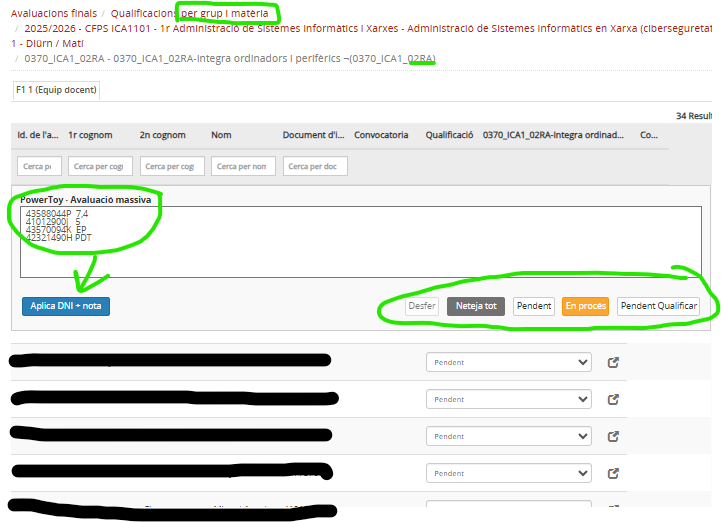
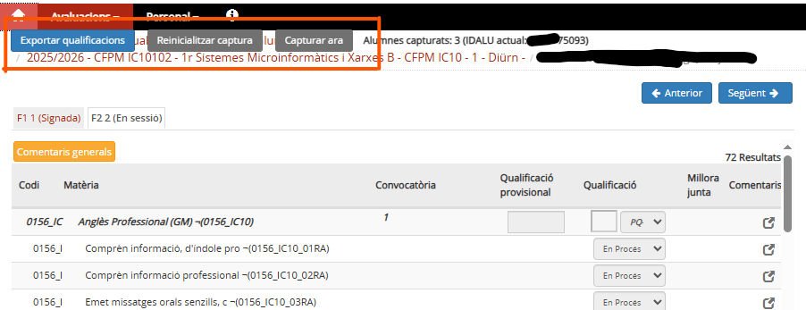

# Esfera-MagicTools

Recull d'eines per a millorar la productivitat i l'explotació de les dades a la plataforma Esfer@ d'avaluació del Departament d'Educació de la Generalitat de Catalunya.

(Inspirat en el projecte [EsferaPowerToys](https://github.com/ctrl-alt-d/EsferaPowerToys/tree/main))

Eines disponibles:
- **Eina 1: Introducció massiva de qualificacions:** Permet aplicar les notes (o l'estat) d'un RA a tot l'alumnat d'un grup. Malauradament, encara cal fer-ho RA a RA.
- **Eina 2: Extracció de qualificacions d'un grup:** Permet extreure les notes de tot l'alumnat d'un grup. Millor que comprar-se una lupa per a intentar veure les actes d'avaluació d'Esfera!

---

## 🔧 Requisits

Per a fer funcionar aquestes eines necessites:

- 🔌 [Tampermonkey](https://www.tampermonkey.net/) — una extensió per a navegadors que permet executar scripts d'usuari.
- 🌐 Un navegador compatible (Chrome, Firefox, Edge...).

---

## 🚀 Instal·lació

1. Instal·la **Tampermonkey** des de la seva web oficial, selecciona el teu navegador i ves a l'apartat `Download`:  
   👉 [https://www.tampermonkey.net/](https://www.tampermonkey.net/)

2. [Només si fas servir Chrome] Ves a la configuració de l'extensió i assegura't que estan autoritzats els scripts d'usuari.

3. Fes clic aquí per instal·lar l'eina o les eines que t'interessin:  
   👉 [`Eina 1 - Introducció massiva de notes per DNI
`](https://raw.githubusercontent.com/jrlgillue/Esfera-PowerToy-Avaluacio-massiva-per-DNI/main/insercio-massiva-per-dni.user.js)

   👉 [`Eina 2 - Extraccio notes grup
`](https://raw.githubusercontent.com/jrlgillue/Esfera-PowerToy-Avaluacio-massiva-per-DNI/main/esfera-extraccio-qualificacions-grup.user.js)

   Tampermonkey t'obrirà una pestanya amb el codi i un botó per **"Install"**.

4. L'script s'activarà automàticament al visitar la pàgina d'Esfera corresponent. En cas necessari, els scripts es poden desactivar al panell de control (dashboard) de TamperMonkey.

---

## 🔧 Eina 1: Introducció massiva de notes per DNI

Cal preparar un fitxer on cada línia tingui el DNI i la nota.

## Funcionalitats actuals

- ✅ Aplicació massiva de notes qualitatives a cada matèria.
- ✅ Traducció automàtica de notes numèriques a valors com `A10`, `A7`, `PDT`, etc.
- ✅ Scroll automàtic a l'assignatura per veure els canvis.
- ✅ Interfície afegida al principi de la pàgina amb inputs i botons útils.

---

## 🔧 Eina 2: Extracció de les notes d'un grup

Cal visitar les pàgines de cadascun dels alumnes. L'script va acumulant les dades. Quan les tenim totes descarreguem el fitxer CSV.

---

## Contribucions

Estàs convidat/da a col·laborar!

- Tens idees per a millorar aquestes eines o crear-ne de noves?
- Has trobat algun error?
- Vols afegir suport a altres parts de l’Esfer@?

Fes un fork del repositori, obre una pull request, o obre una issue. Totes les contribucions són benvingudes!

📌 Repositori:  
[https://github.com/jrlgillue/Esfera-MagicTools](https://github.com/jrlgillue/Esfera-MagicTools)

---

## Llicència MIT — Sense responsabilitats

Aquest projecte està distribuït sota la llicència [MIT](./LICENSE).

**Això vol dir:**

- Pots utilitzar, modificar i redistribuir lliurement el codi.
- El codi s'ofereix **tal com és**, **sense garanties de cap mena**.
- L’autor **no es fa responsable** de cap dany, error o conseqüència derivada del seu ús.

Fes-lo servir sota la teva responsabilitat i sentit comú.

---

